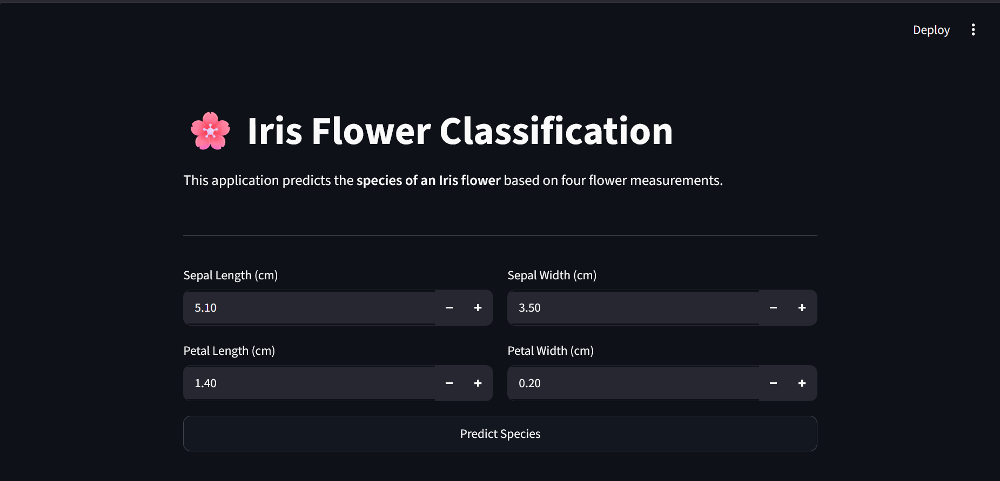
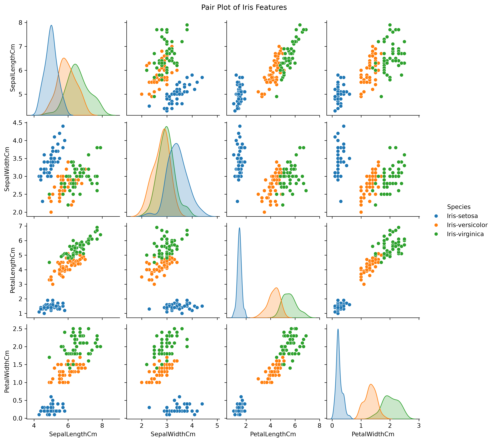
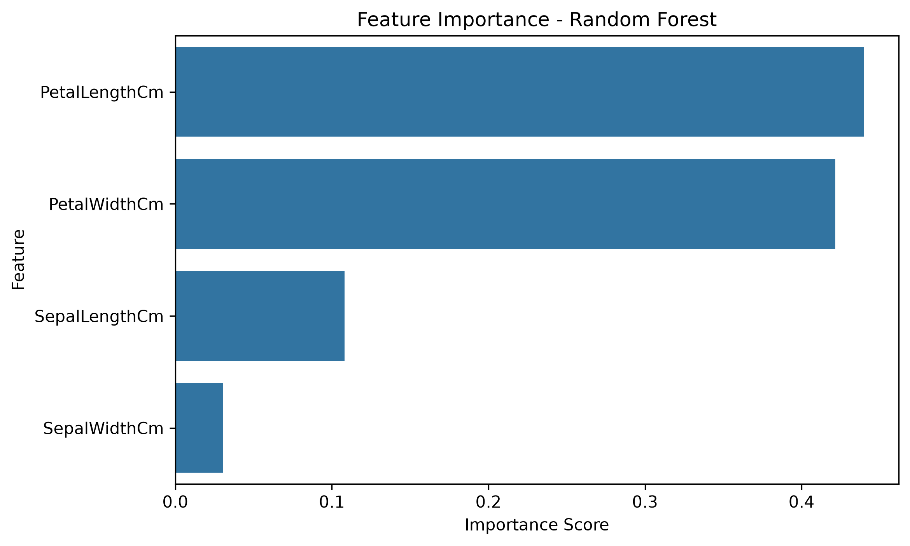
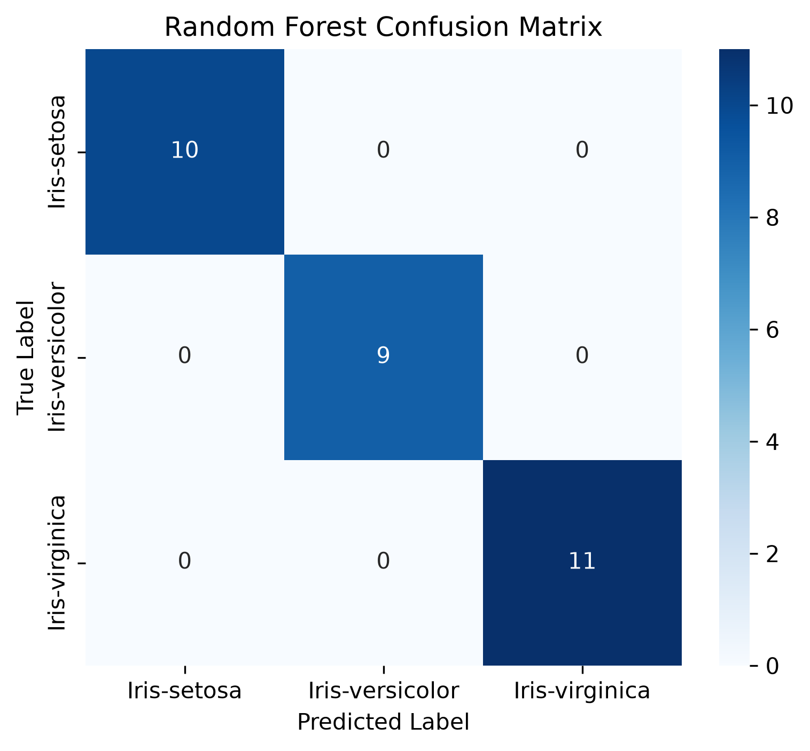

# 🌸 Iris Flower Classification

A Machine Learning project developed as part of the **CodeAlpha Data Science Internship**.

The application predicts the species of an Iris flower using four flower measurements and is deployed using **Streamlit**.

## 📌 Project Overview

This project predicts the species of an Iris flower using machine learning.

The model classifies flowers into:

- Iris-setosa
- Iris-versicolor
- Iris-virginica

based on four flower measurements.

---
## 📸 Project Preview

### 🌐 Streamlit Web Application



---

### 📊 Pair Plot

The pair plot shows the relationship between all numerical features. It clearly demonstrates that **Petal Length** and **Petal Width** separate the three Iris species much better than the sepal measurements.



---

### 📈 Feature Importance

Random Forest identified **Petal Length** and **Petal Width** as the most important features for predicting the flower species.



---

### 📉 Confusion Matrix

The confusion matrix of the Random Forest model shows that the classifier correctly predicted all samples in the test dataset.




## 🚀 Technologies Used

- Python
- Pandas
- NumPy
- Matplotlib
- Seaborn
- Scikit-learn
- Streamlit
- Joblib

---

## 📂 Project Structure

```
CodeAlpha_Iris_Classification/

├── App/
├── Data/
├── Images/
├── Models/
├── Notebooks/
├── README.md
├── requirements.txt
└── LICENSE
```
## ✨ Features

- Data Cleaning and Preprocessing
- Exploratory Data Analysis (EDA)
- Multiple Machine Learning Models
- Model Comparison
- Feature Importance Analysis
- Streamlit Web Application
- Interactive Flower Species Prediction

---

## 📊 Machine Learning Workflow

- Data Loading
- Data Cleaning
- Exploratory Data Analysis
- Feature Engineering
- Train-Test Split
- Model Training
- Model Evaluation
- Feature Importance
- Model Saving
- Streamlit Deployment

---

## 🤖 Models Used

- Logistic Regression
- Decision Tree
- Random Forest

---

## 📈 Model Performance

| Model | Accuracy |
|--------|----------|
| Logistic Regression | 100% |
| Decision Tree | 100% |
| Random Forest | 100% |

---
## 🌐 Live Demo

🔗 https://codealphairisclassification-fvvyay6urappyxcn229fbev.streamlit.app/

---
## ▶️ Run the Project

### Clone the repository

```bash
git clone https://github.com/ysunny790/CodeAlpha_Iris_Classification.git
```

### Navigate to the project directory

```bash
cd CodeAlpha_Iris_Classification
```

### Install dependencies

```bash
pip install -r requirements.txt
```

### Run the Streamlit app

```bash
cd App
python -m streamlit run app.py
```
## 👨‍💻 Author

Sunny Yadav
